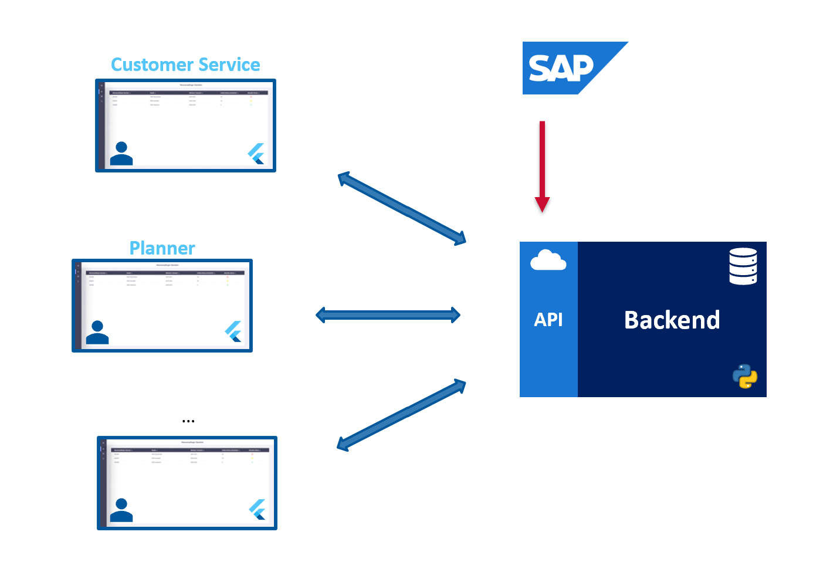
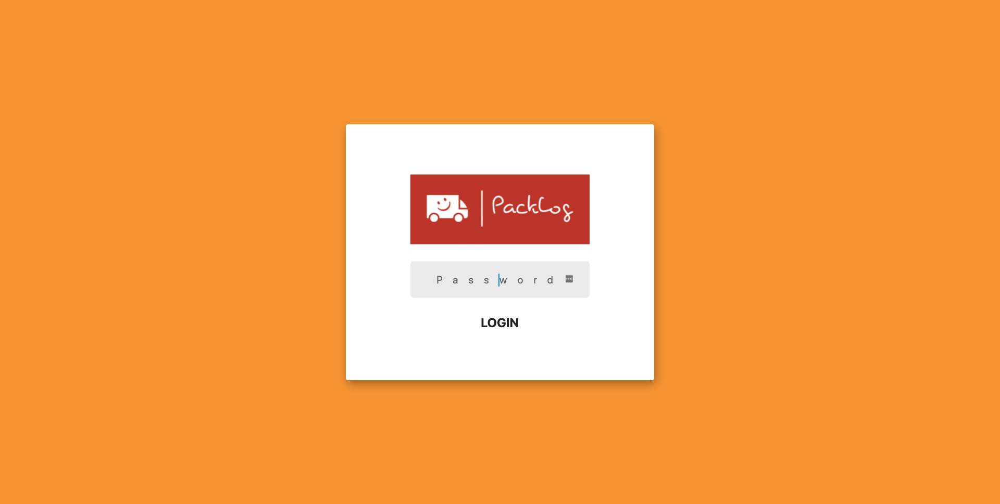
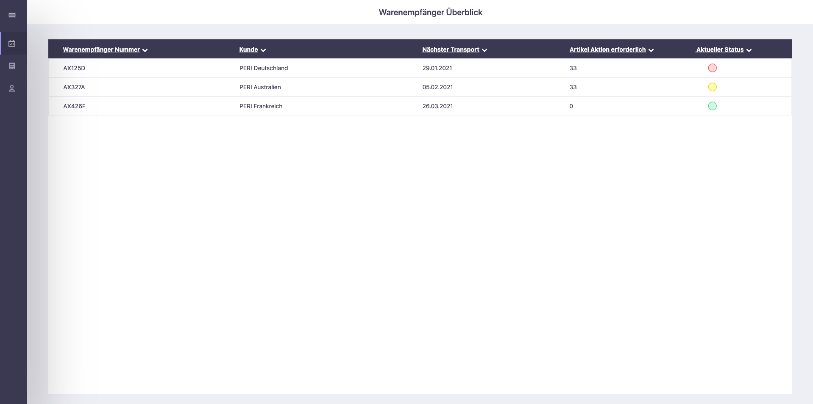
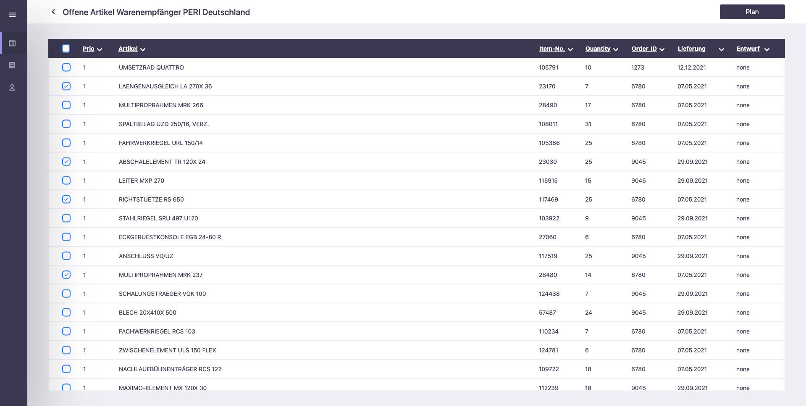
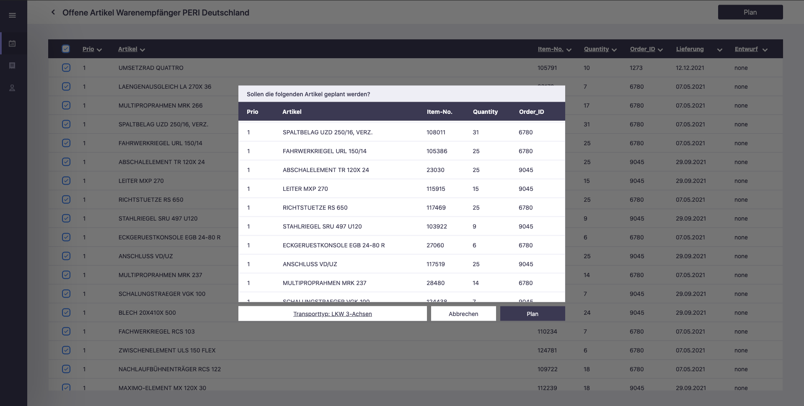
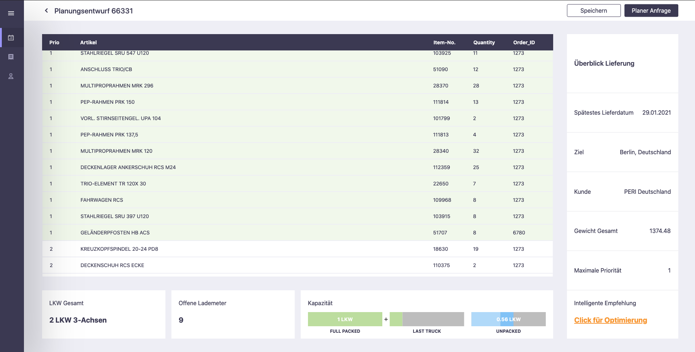
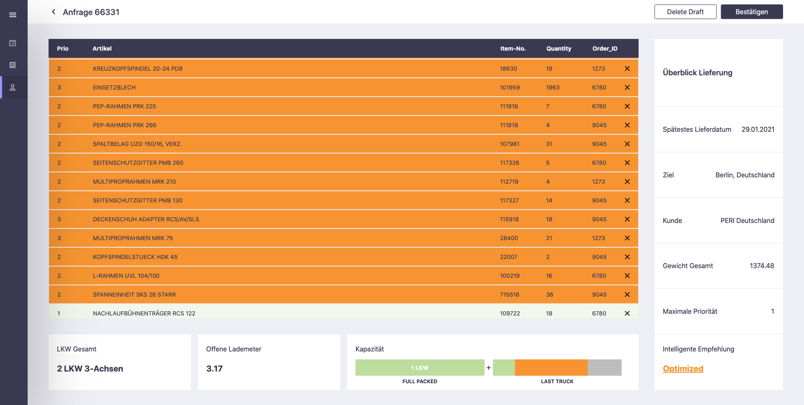
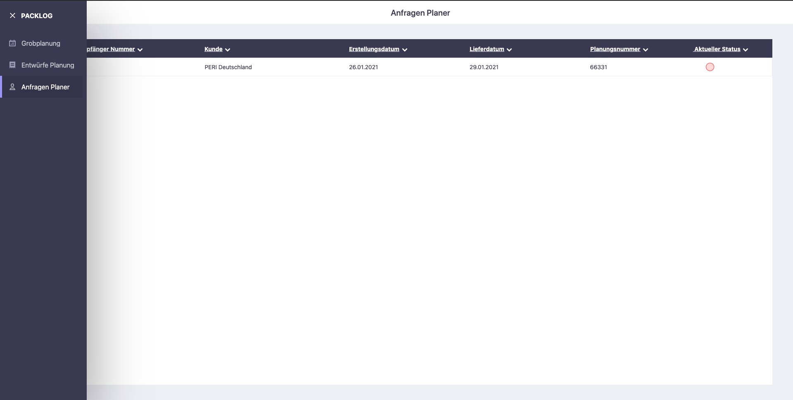
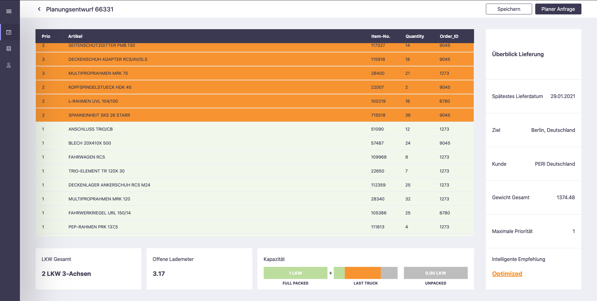

# PackLog Rough Estimation

## Contributors

- Lukas Pries (lukas.pries@tum.de)
- Leander Lauenburg (leander.lauenburg@gmail.com)
- Marcel Perez San Blas (marcel.perez-san-blas@manageandmore.de)
- Franz Schubart (franz.schubart@manageandmore.de)

## Introduction
Every day, logistics companies struggle to plan, pack, and ship their orders efficiently. It is a process that requires careful planning and communication between individual parties like the customer service (CS), planners,  packers, and logistic operators. Additionally, seemingly simple tasks, like efficiently packing a transport vehicle, are far from trivial due to multiple constraints. In short: The process's many stakeholders and unknowns demand considerable manual work and human brainpower.  Therefore, applying machine intelligence (MI) to this process has immense potential  - orders would directly be passed to the packer, modifications would take effect immediately, scheduling and packing efficiency would increase. However, to make the application of MI feasible the whole process first has to be digitalized. To this end, we proposed a holistic step-by-step approach.  In close cooperation with our industrial partners, we identified digitalizing the "rough planning stage" as the first step. The rough planning stage takes place directly after the CS has received an order from a customer. The CS relays the order to a planner. The planner estimates the required transport units and communicates this information back to the CS. At this point, the CS gives feedback to the customer on the space utilization of the transport vehicles. Should the customer demand no further changes, the CS book's the vehicles. Currently, this first stage takes on average three days.


## Rough Estimation Tool
We developed a rough estimation tool that allows the CS to receive a transport unit estimate immediately by simply selecting the respective order. Our solution comprises an intuitive user interface (UI) that can be accessed everywhere and on any device (Phone, Tablet, Web, Desktop). The UI communicates via well-defined API calls with the central server that is running our intelligent planning algorithms. This makes our solution lightweight, facilitates accessibility, and allows for an easy adaption of the planning models.

In the following, we will describe the platform's architecture.

<br></br>

## Getting Started

### Requirements

* [Install Anaconda](https://docs.anaconda.com/anaconda/install/)

### Installation

1. Clone Repository
```
git clone https://gitlab.lrz.de/lupries/packlogsolutions.git
cd packlogsolutions
```

2. Setup Virtual Python Environment
```
conda update conda
conda create --name packlog python=3.8
conda activate packlog
conda install --file requirements.txt
```
after you have installed new python packages, update requirements.txt file:
```
conda list --explicit > requirements.txt
```

### Start Backend Server

The following command will start a local server (http://127.0.0.1:5000/) hosting the backend API:
```
python -m backend.api.api -n "database_name" -p "password"
```

### Start Frontend

- [Install Flutter (Beta)](https://flutter.dev/docs/get-started/install)
- [Install Chrome]()
```
flutter config --enable-web
flutter devices     # check if chrome is avalable
flutter run -d chrome
flutter build web
```

<br></br>

## Things used in this project

### Programming Languages

 [Python](https://www.python.org/)

 [Dart](https://dart.dev/)

 [SQL](https://dart.dev/)

### Frameworks

 [Flask RESTful API](https://flask-restful.readthedocs.io/en/latest/)

 [PostgreSQL Database](https://www.postgresql.org/)

 [Flutter UI Framework](https://flutter.dev/)

### Platforms

 [Firebase Hosting](https://firebase.google.com/docs/hosting)

 [Scalingo Cloud Hosting](https://scalingo.com/)

<br></br>

## Code Repository ([GitLab](https://gitlab.lrz.de/lupries/packlogsolutions))

`data` - directory for datasets

`backend` - directory for python backend and api

`frontend` - directory for flutter ui

<br></br>

## Architecture Overview

<div style="text-align:center"></div>

The architecture overview presents the frontend, backend and visualizes the API. Note that integration of other APIs such as SAP is possible via the API layer. In the following, we start by describing the backend.

<br></br>

## Backend
The backend represents the brain of our platform. It holds the whole logic to calculate our rough planning estimations. To guaranty a modular structure and a simplistic design, we implemented the backend in Python.

>#### [Python](https://www.python.org/) 
>Python is an interpreted, object-oriented, high-level programming language which has simple and easy to learn syntax. It emphasizes readability and therefore reduces the cost of program maintenance. Further, Python supports modules and packages, which encourages program modularity and code reuse. Python is therefore the right choice to programm our modular estimation logic in the backend. We use Python to setup the communication with the front-end and process incoming lists of data. It allows us to performing math calculations and incorporate common machine learning frameworks.

#### Entities
In the backend, we created object classes of all relevant entities such as `Item, Order, TransportUnit`. Code can be found under `backend/logic`.

```
# How to initialize data objects
item            = Item(id=1, name="test_item", dimensions=[1., 1., 1.], weight=1.)
item            = Item.from_item_query(item_query)
```

>Several modules are needed to process the incoming order data.

#### DataManager
First, the `DataManager` is responsible for querying all relevant data about the items (weight, volume, material, ...) from the database (described below). 

```
# How to use DataManager
data_manager = DataManager(password, dbname, username)
data_manager.connect()
```

#### Scheduler
Having constructed parameterized objects of all items in the order list, the `Scheduler`-Class is used to sort the orders based on recipient-ID, priorities and delivery date.

```
# How to use scheduler
scheduler       = Scheduler(data_manager)
pool            = scheduler.add_order_to_pool(item_query, quantity, client_id, order_id, date, out_date, prio)
pool_ordered    = scheduler.order_pool()
```

#### Packer
Finally, the `Packer` gets the ordered item lists and uses several iterative algorithms to pack items into the relevant transport units and returns an estimate of the required number of units for the requested order.

```
# How to use the packer
packer                  = Packer(transport_units, pool_ordered)
free_trans_cap          = packer.free_trans_cap(report=True)
pool_item_cap           = packer.full_items_cap(pool, prio=None)
client_items_cap        = packer.client_items_cap(pool, client_id, prio=None, order_id=None)
```

The backend also includes a database which holds all relevant data of the items such as id, name, weight, volume and material. We therefore choose a popular SQL database to store this information. The connection to the backend code established by SQL queries that can be made using the python package `psycopg2`.
>#### [PostgreSQL Database](https://www.postgresql.org/) 
>PostgreSQL is a powerful, open source object-relational database system which has earned a strong reputation for reliability, feature robustness, and performance. PostgreSQL lets you setup professional SQL databases and is widely supported for hosting databases in the cloud. We choose PostgreSQL to create a professional database of all Item information that can easily be deployed to our cloud environment.

### REST API
As described in the architectue overview, our backend is communicating to the frontend via an a REpresentational State Transfer (REST) API. This allows us to get the planning estimate by simply sending a (http) POST request attached with the order information. In return the Backend API will reply with a return message including the final estimate. We used the Flask RESTful framework to setup the appropriate request endpoints. A detailed description of the API calls can be found in API Documentation section below. Code can be found under `backend/api`.

>#### [Flask RESTful API](https://flask-restful.readthedocs.io/en/latest/) 
>Flask-RESTful is an extension for Flask (web development framework) that adds support for quickly building REST APIs. It is a lightweight abstraction that works with our backend and database.

### Backend Hosting
To make our backend service accessible via the API, we need to deploy and run it to a server platform. There are hundreds of such cloud platforms out there.  We choose Scalingo for this demo. For a detailed description of how to deploy your code to the server environment and set up the database please refer to the [Scalingo Documentation](https://doc.scalingo.com/).

>#### [Scalingo Cloud Hosting](https://scalingo.com/) 
>Scalingo offers Automatic Cloud Hosting which allows for easy setup and deployment of a server in the cloud. We use this platform to host our python backend API.

## Frontend

The User Interface (UI) represents the graphical interface through which the user can interact with the platform. We required it to be well-structured, easy to use, and highly responsive. To make our tool available to any platform, device, and location, we implemented it using the cross-platform development framework Flutter. A Flutter application can be deployed to all platforms (including the web) using a single codebase.

>#### [Flutter UI Framework](https://flutter.dev/) 
>Flutter is a cross-platform User Interface (UI) toolkit for building beautiful, natively compiled applications for mobile, web, and desktop from a single codebase. The framework allows to build fully-customizable widgets in a layered achitecture. A major advatage is that one developed codebase can be compiled to deploy a webapp, desktop as well as ios and android apps.

All developed views and a short description can be found below.

<br></br>

### Landing Page View

<div style="text-align:center"></div>

>User: Customer Service, Planner

The landing page gives access to the appropriate user via a Login Screen.

### Recipients Overview

<div style="text-align:center"></div>

>User: Customer Service

This view lists all the recipients including the current status of the orders and additional information. Each recipient can be selected to view the ordered items.

### Order View

<div style="text-align:center"></div>

>User: Customer Service

The order view depicts the order pool of a selected recipient. The user can select different items manually, sort the pool based on the column categories, or select all items by checking the top left box. Having selected a set of items we can click on the `Plan` Button in the top right corner.

### Confirm Selection View

<div style="text-align:center"></div>

>User: Customer Service

Having selected a set of items from a recipients item pool, and after clicking on `Plan` in the top right corner, this view depicts the selection of items and asks for confirmation. This forwards us to the `Planning Draft View`.

### Planning Draft View

<div style="text-align:center"></div>

>User: Customer Service

This view depicts how many vehicles of the given type are needed to fit all items with priority one. The fitted items are marked in green. The three bars on the bottom right depict (left to right) the number of fully packed transport vehicles, the space utilization of the last (not fully packed) vehicle, the capacity of the so far unpacked items of priority two (light blue), and priority three (dark blue).

<div style="text-align:center"></div>

To utilize the space of the vehicle that is not fully packed yet, we can click on the `Click for Optimization` button on the bottom right corner. 
In the background, the frontend now sends an HTTP request to the backend server attached with all the selected item ids. In the backend, our intelligent logistic engine now fits as many of the items of prio two (light blue) and prio three (dark blue) into the free space. The items which fitted the last truck are depicted in orange.

We can now either select `Save` or `Request Planner` in the top right view. Selecting save we return to the `Recipients Overview` and can start planning the next order. Selecting `Request Planner` we also get redirected to the `Recipients Overview` however in this case the order now appears on the `Planner Request View` and is still pending confirmation by a planner.

### Planner Request View

<div style="text-align:center"></div>

>User: Planner

As the planner, I can log into Packlog and check on the `Planner Request View` which orders need to be confirmed by a planner. The view lists all the orders of recipients that have to be double-checked.

### Planner Confirmation View

<div style="text-align:center"></div>

>User: Planner

Having selected an order pending confirmation, the planner can remove items from the order and adjust all other values, like the number of trucks needed. In the top right corner, the planner can either delete the draft or save it. Saving or deleting the draft, the planner gets redirected to the `Planner Request View`. Here he can check the next order in need of confirmation.

### Frontend Hosting

For the prototype, we deployed our User Interface as a web application accessible via a browser. Note that it is also possible to deploy the Interface as a mobile or desktop application. To host the web application on a public domain we use the platform Firebase.

>#### [Firebase Hosting](https://firebase.google.com/docs/hosting)  
>Firebase Hosting provides fast and secure hosting for our web app. We choose Firebase Hosting because it allows us to quickly deploy our web app and serve both static and dynamic content to the web. Firebase offers a free pricing plan that is sufficient to serve our User Interface in the prototyping stage and easy upgradable to a 'pay as you go' plan.

<br></br>

## API Documentation

The API is organized around REST. Our API has predictable resource-oriented URLs, accepts form-encoded request bodies, returns JSON-encoded responses, and uses standard HTTP response codes.

### Estimator

|  | |
|--------|--------|
| Type: | POST |
| URL: | `http://127.0.0.1:5000/estimator` |
| Body_type: | json |
| Response_type: | json |

Example body:

```
{
    "client_id": 1, "order_id": 2, "date": (1,1,20), "out_date": (1,1,20), "transport_unit": "truck", 
    "items_id_prio_quant": [
        {"quantity": 8.0, "id": 118737.0, "prio": 1},
        {"quantity": 31.0, "id": 22560.0, "prio": 2}]
}
```

Example response:

```
{
    "estimate": {
        "1": [0.72, 0.0],
        "2": [0.0, 0.75],
        "3": [0.0, 0.84]
    }
}
```

### Packer

|  | |
|--------|--------|
| Type: | POST |
| URL: | `http://127.0.0.1:5000/packer` |
| Body_type: | json |
| Response_type: | json |

Example body:

```
{
    "client_id": 1, "order_id": 2, "date": (1,1,20), "out_date": (1,1,20), "transport_unit": "truck", 
    "items_id_prio_quant": [
        {"quantity": 8.0, "id": 118737.0, "prio": 1},
        {"quantity": 31.0, "id": 22560.0, "prio": 2}]
}
```

Example response:

```
{
    "estimate": {
        "1": [0.72, 0.0],
        "2": [0.26, 0.48],
        "3": [0.0, 0.84]
    },
    "n_items_last": [
        112133,
        23170,
        25730,
    ]
}
```

<br></br><br></br>

## Examples/Tests

### Send POST requests to API

Start Backend server and execute test script:
```
python -m backend.api.test_api 
```

### Test logic functions

```
python -m backend.examples.test_schedular -n "database_name" -p "password"
python -m backend.examples.test_packer -n "database_name" -p "password"
```
